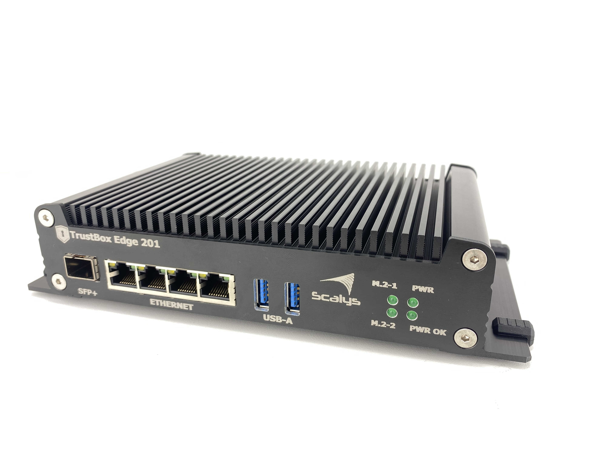
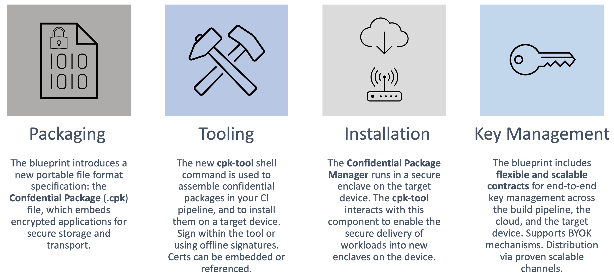
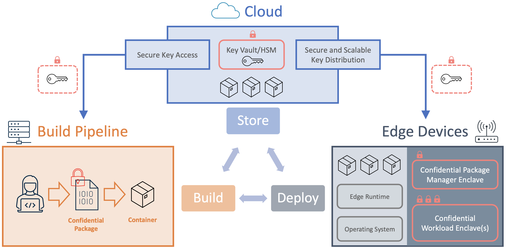

# Enclave Device Blueprint for Confidential Computing at the Edge

# Welcome

This sample project brings together everything that you need in order to learn about and get
familiar with the Enclave Device Blueprint for Confidential Computing at the Edge. This blueprint is
being developed as a collaboration between [Microsoft](https://www.microsoft.com),
[Scalys](https://scalys.com) and [Arm](https://www.arm.com). It is intended to enable the mainstream
adoption of confidential computing practices in edge computing deployments.

# The Blueprint

The Enclave Device Blueprint was launched at [Arm DevSummit](https://devsummit.arm.com) in October
2021. You may have just watched the session or read the [whitepaper](https://aka.ms/edb-whitepaper)
and you are keen to learn more. This sample will get you started with the process of exploring the
blueprint and putting it into practice. Here you will find instructions, sample source code, and
links to a variety of resources to get started with the blueprint using cloud services from
[Microsoft Azure](https://azure.microsoft.com), and the [Scalys TrustBox Edge
201](https://aka.ms/edb-tb201) (below).

The purpose of the blueprint is to enable the execution of confidential computing workloads at the
edge. The TrustBox Edge 201 is an edge computing device that is capable of executing confidential
computing workloads by utilizing the hardware-enforced isolation capabilities of [Arm
TrustZone](https://developer.arm.com/ip-products/security-ip/trustzone). Alongside the device, the
blueprint brings additional tools and architectural patterns to ensure that workloads are delivered
with end-to-end protection of their confidentiality, right from the point where the application is
built, all the way to the point of execution within the hardware-isolated enclave. The code and
resources in this sample will allow you to realize this blueprint for a demo application that uses a
confidential Machine Learning model.

# Components

### Packaging

The open-source specifications for Confidential Packaging are being maintained [in
GitHub](https://github.com/Scalys/ConfidentialPackageSpecification). Head to the repository to
understand details such as the file format.

### Tooling

The open-source tools for the building and installation of Confidential Package files are being
actively developed using the [Rust programming language](https://www.rust-lang.org). Head over to
the [GitHub repository](https://github.com/Scalys/ConfidentialPackageTools) to learn how to build
and use the tools in your own deployments.

### Installation

The Confidential Package Manager (CPM) is the component that is responsible for installing
confidential workloads and getting them ready for execution on the device. The Scalys TrustBox Edge
201 comes with this component already built in, so you will not need to build it yourself in order
to get started. However, this component is also being developed fully in open-source, and you can
find it [on GitHub](https://github.com/Scalys/ConfidentialPackageManager).

### Key Management

The Enclave Device Blueprint offers a very flexible model for key management. In this sample you can
learn how to use the [Azure Key
Vault](https://azure.microsoft.com/en-gb/services/key-vault/#product-overview) service to safeguard
the cryptographic keys that are needed to protect your confidential workloads. You will also see an
example of how [Azure Functions](https://azure.microsoft.com/en-gb/services/functions) can be used
to provide the secure access and distribution of keys to both your build pipeline and your edge
devices.

# Architecture

The image below shows how the components of the blueprint interact. The end goal is to build,
publish, deploy and execute confidential applications such that their contents are not revealed
anywhere in between the point where they are first built, up until the point where they are
installed and executing within a hardware-isolated enclave on the edge device.

In the build pipeline, the application is transformed into a Confidential Package file, which
applies a layer of encryption using a key that is shared securely from the key vault in the cloud.
The Confidential Package file can also embed signatures, certificates and other resources that will
allow the target edge device to verify its authenticity. Once it is built, the Confidential Package
file can easily be embedded in a container, along with the other non-confidential parts of the
application. This allows for the confidential workload to be distributed to its target edge devices
very conveniently, using the familiar mechanism of container repositories.

 

# Getting Started

This sample project realizes the blueprint solution architecture using Microsoft Azure. To get
started, you will need to set up an Azure account and populate it with some required resources. Head
over to the [Azure environment setup guide](./docs/azure-environment-setup.md) to find out how to do
this.

The next stage will be to build the demo application and deploy it to your device.

**TODO: Link to demo app source code and instructions for build**

# Where To Learn More

- **Read the Whitepaper** : (https://aka.ms/edb-whitepaper)
- **Read the Blogs** : (https://aka.ms/edb-blogs)
- **Get the Scalys TrustBox Edge 201** : (https://aka.ms/edb-tb201)
- **Try the demo now** : (https://aka.ms/edb-demo)
- **Device and solution** : (https://aka.ms/edb-components)
- **Resources and Communities**: (https://aka.ms/edb-resources)
